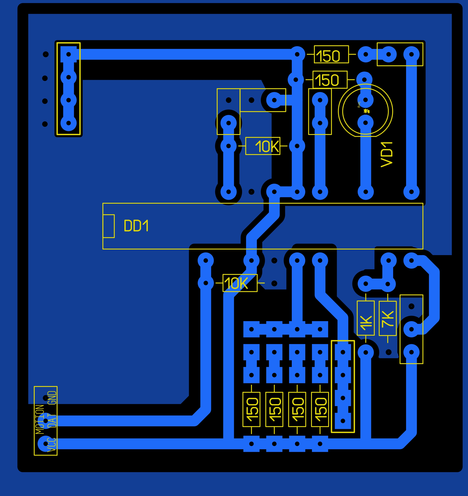
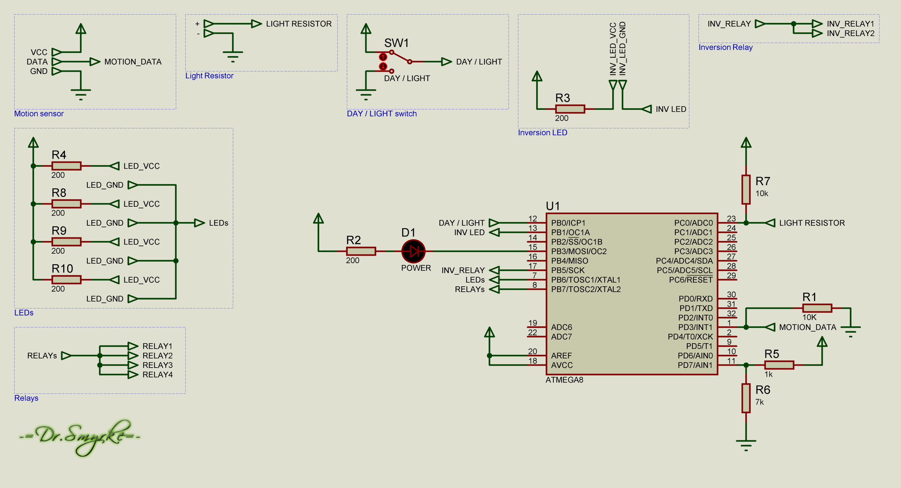

# Motion-Switch
Universal device for smart home with motion sensor

### PCB Layout V2

### Shematic V2

### PCB Layout V1

### Shematic V1

### Photos
http://drsmyrke.ru/projects/?cat=DIY&item=Motion%20Switch
